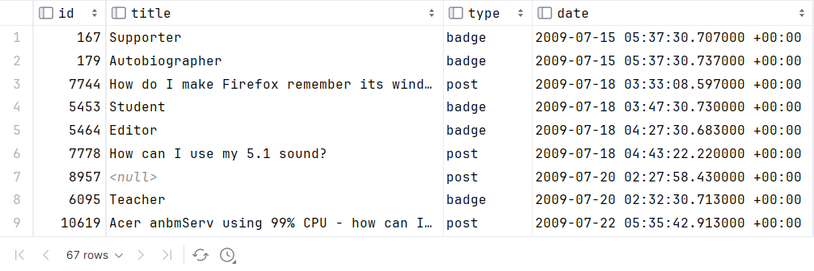
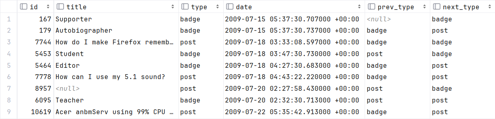
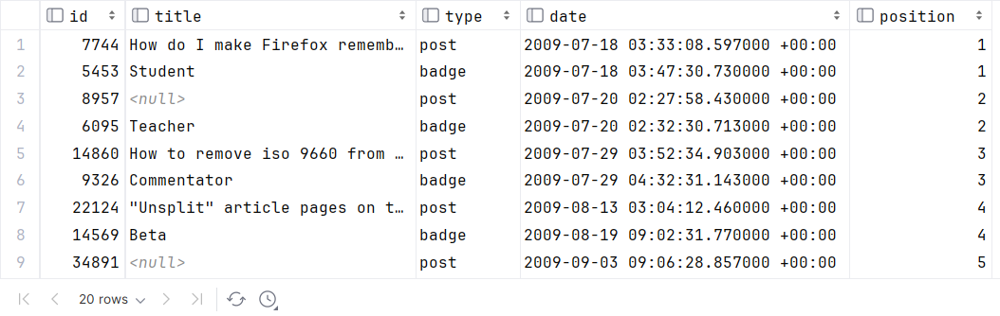
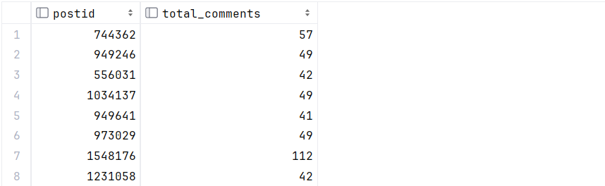
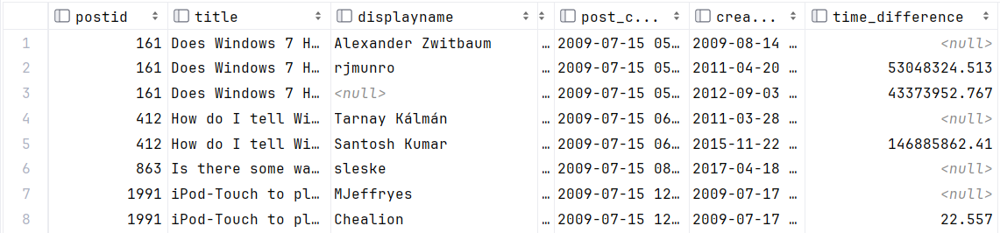

Sira Dariia -- 119436

#### **ASSIGNMENT 3 DOCUMENTATION**

---

**Endpoint 1**

**GET /v3/users/:user id/badge history**

For the selected user, analyse the badges they have earned so that they are in the following order all the badges obtained together with the previous report written by the author before the actual obtaining of the badges badge.

If the badge has been earned and no report has been sent before the badge, then the badge is does not appear.

For example, if he/she has earned 2 badges and several badges have been sent before, only the first badge is displayed in the progress. badge with the last preceding badge being shown.

The individual pairs of sending a post and then receiving a post must be marked in the order (1, 2, 3, 4)

**Query explanation:**
1. Firstly, I had selected and connected all info about posts and badges: _id, title, type_ and date, where _userid=120_ and ordered by _date_.
Now we see unsorted table with all information in sub query **general**:
```
(SELECT DISTINCT posts.id, posts.title, 'post' AS type, posts.creationdate AS date
FROM posts
JOIN users ON posts.owneruserid = users.id
WHERE users.id = 120)
    UNION ALL
(SELECT DISTINCT badges.id, badges.name, 'badge' AS type, badges.date AS date
FROM badges
WHERE badges.userid = 120)

ORDER BY date
```


2. The table **ordered** selects all info fro sub table **general** and also utilizes the LAG and LEAD window functions to get the type of the previous and next rows to filter the last post for every badge.
This is used later in the WHERE clause to filter the rows based on the types of adjacent rows.
```
SELECT *,
            LAG(type) OVER (ORDER BY date) AS prev_type,
            LEAD(type) OVER (ORDER BY date) AS next_type
    FROM (general)
```


3. The last finished query selects needed info and set position for every pair of posts and badge.
The CASE statement calculates the position based on the type of the current row and the previous row. If the current row is of type 'post', it assigns a position equal to half the row number plus one. If the previous row was of type 'post', it assigns a position equal to half the row number. This is an interesting way to assign positions of posts and badges in a sequence order.
```
SELECT id, title, type, date,
       CASE WHEN type = 'post' THEN ROW_NUMBER() OVER (ORDER BY date) / 2 + 1
            WHEN prev_type = 'post' THEN ROW_NUMBER() OVER (ORDER BY date) / 2
       END AS position
FROM (ordered)
WHERE (type = 'post' AND next_type = 'badge') OR (type = 'badge' AND prev_type = 'post');
```


**SQL Request:**
```
SELECT id, title, type, date,
               CASE WHEN type = 'post' THEN ROW_NUMBER() OVER (ORDER BY date) / 2 + 1
                    WHEN prev_type = 'post' THEN ROW_NUMBER() OVER (ORDER BY date) / 2
               END AS position
        FROM
            (SELECT *,
                    LAG(type) OVER (ORDER BY date) AS prev_type,
                    LEAD(type) OVER (ORDER BY date) AS next_type
            FROM (
                    (SELECT DISTINCT posts.id,
                            posts.title,
                            'post' AS type,
                            posts.creationdate AS date
                    FROM posts
                    JOIN users ON posts.owneruserid = users.id
                    WHERE users.id = 120)
                    UNION ALL
                    (SELECT DISTINCT badges.id,
                            badges.name,
                            'badge' AS type,
                            badges.date AS date
                    FROM badges
                    WHERE badges.userid = 120)
                    ORDER BY date) AS general) AS ordered
        WHERE (type = 'post' AND next_type = 'badge') OR (type = 'badge' AND prev_type = 'post')
```

**HTTP end-point call example** for _ID=120_: http://127.0.0.1:8000/v3/users/120/badge_history
```
{
  "items": [
    {

      "id": 7744,
      "title": "How do I make Firefox remember its window size?",
      "type": "post",
      "created_at": "2009-07-18T03:33:08.597+00",
      "position": 1
    },
    {
      "id": 5453,
      "title": "Student",
      "type": "badge",
      "created_at": "2009-07-18T03:47:30.730+00",
      "position": 1
    },
    {
      "id": 8957,
      "title": null,
      "type": "post",
      "created_at": "2009-07-20T02:27:58.430+00",
      "position": 2
    },
    {
      "id": 6095,
      "title": "Teacher",
      "type": "badge",
      "created_at": "2009-07-20T02:32:30.713+00",
      "position": 2
    }
    ...
```


**Endpoint 2**

**GET /v3/tags/:tag/comments?count=:count**

For the specified tag, calculate the number of comments for the individual posts that have more than the specified number of comments (specified in the API endpoint frame), the average response time between individual comments in the given post frame.

**Query explanation**

1. Firstly, I created the sub_query **sub_table_limited** for counting the number of comments.
The JOIN clause joins the **difference_table** subquery with another subquery that selects _postid_ and counts the total number of comments for each post. This subquery is aliased as **sub_table_limited**. The JOIN condition ensures that only posts with more than _count_ comments are considered.
```
JOIN (SELECT postid, COUNT(*) AS total_comments
        FROM comments
        GROUP BY postid
        HAVING COUNT(*) > 40) sub_table_limited ON difference_table.postid = sub_table_limited.postid
```


2. Main query for calculating the time difference. This query retrieves details about comments on posts tagged and calculates the time difference between consecutive comments for each post.  The results are ordered by post ID and comment creation date.
```
SELECT comments.postid,
            posts.title,
            users.displayname,
            comments.text,
            posts.creationdate AS post_created_at,
            comments.creationdate,
            EXTRACT(EPOCH FROM (comments.creationdate - LAG(comments.creationdate) OVER (PARTITION BY comments.postid ORDER BY comments.creationdate))) AS time_difference
        FROM comments
        JOIN posts ON comments.postid = posts.id
        FULL JOIN users ON comments.userid = users.id
        JOIN post_tags ON comments.postid = post_tags.post_id
        JOIN tags ON post_tags.tag_id = tags.id
        WHERE posts.parentid IS NULL AND tags.tagname = 'networking'
        ORDER BY comments.postid, comments.creationdate
```

3. The outermost SELECT statement selects all columns from the difference_table subquery and calculates the average time difference over each partition of posts. The AVG window function is used with the OVER clause to calculate the average time difference over each partition, which is partitioned by postid and ordered by the creation date of the comments.
See code in main SQL Request and example of output in HTTP call example:

**SQL Request:**
```
SELECT *,
                AVG(time_difference) OVER (PARTITION BY difference_table.postid ORDER BY difference_table.creationdate) AS avg
            FROM
                (SELECT comments.postid,
                        posts.title,
                        users.displayname,
                        comments.text,
                        posts.creationdate AS post_created_at,
                        comments.creationdate,
                        EXTRACT(EPOCH FROM (comments.creationdate - LAG(comments.creationdate) OVER (PARTITION BY comments.postid ORDER BY comments.creationdate))) AS time_difference
                    FROM comments
                    JOIN posts ON comments.postid = posts.id
                    FULL JOIN users ON comments.userid = users.id
                    JOIN post_tags ON comments.postid = post_tags.post_id
                    JOIN tags ON post_tags.tag_id = tags.id
                    WHERE posts.parentid IS NULL AND tags.tagname = %s
                    ORDER BY comments.postid, comments.creationdate) AS difference_table

            JOIN (SELECT postid, COUNT(*) AS total_comments
                    FROM comments
                    GROUP BY postid
                    HAVING COUNT(*) > %s) sub_table_limited ON difference_table.postid = sub_table_limited.postid

```

**HTTP end-point call example** for _tag=linux_ and _count=40_: http://127.0.0.1:8000/v3/tags/networking/comments/?count=40
```
{
  "items": [
    {
      "post_id": 1034137,
      "title": "Did I just get hacked?",
      "displayname": "Jonno",
      "text": "Yeah that doesn't look too good. I'm not an expert in Linux by any means, but somethings definitely tried to execute on there. I'm not quite sure how though as it looks like it attempted to log in as root and failed. Are there any other logs in your auth.log? Any other means of remote admin? I've seen Mac's with VNC server enabled get hacked before via that, although this looks like an SSH attempt. Looks like the IPs it was downloading from are hosted in China somewhere.",
      "post_created_at": "2016-02-01T10:21:48.690000+00:00",
      "created_at": "2016-02-01T10:25:02.610+00",
      "diff": null,
      "avg": 1034137
    },
    {
      "post_id": 1034137,
      "title": "Did I just get hacked?",
      "displayname": "David Schwartz",
      "text": "The attack actually came from China.",
      "post_created_at": "2016-02-01T10:21:48.690000+00:00",
      "created_at": "2016-02-01T10:30:45.310+00",
      "diff": "342.700000",
      "avg": 1034137
    }
    ...
```


**Endpoint 3**

**GET /v3/tags/:tagname/comments/:position?limit=:limit**

Return comments for posts with the tag, which were created as the next in order (:position) of the sorted according to the creation date of the :limit sequence.

**Query explanation**

1. This query retrieves details about the second comment on tagged posts. It selects the _comment ID, user display name, post body, comment text, comment score_, and assigns a position to each comment within its post using the ROW_NUMBER() window function.
2. The query then filters for comments with a position number, indicating the position comment on each post, and limits the output to only one result.

**SQL Request:**
```
SELECT * FROM
             (SELECT comments.id,
                     users.displayname,
                     posts.body,
                     comments.text,
                     comments.score,
                     ROW_NUMBER() OVER (PARTITION BY comments.postid ORDER BY comments.creationdate) AS position
                FROM comments
                JOIN posts ON comments.postid = posts.id
                FULL JOIN users ON comments.userid = users.id
                JOIN post_tags ON comments.postid = post_tags.post_id
                JOIN tags ON post_tags.tag_id = tags.id
                WHERE posts.parentid IS NULL AND tags.tagname = 'linux'
                ORDER BY posts.creationdate) AS ordered_table
WHERE position = 2
LIMIT 1;
```
**HTTP end-point call example** for _tag=linux, position=2_ and _limit=1_: http://127.0.0.1:8000/v3/tags/linux/comments/?limit=1&position=2
```
{
  "items": [
    {
      "id": 745427,
      "displayname": "Oliver Salzburg",
      "body": "<p>I am running Kubuntu Hardy Heron, with a dual monitor setup, and have VirtualBox on it running Windows XP in seamless mode.</p>\n\n<p>My problem is, I can't get VirtualBox to extend to the second monitor. \nHow can this be achieved?</p>\n",
      "text": "http://ubuntuforums.org/showthread.php?t=433359",
      "score": 0,
      "position": 2
    }
  ]
}
```


**Endpoint 4**

**GET /v3/posts/:postid?limit=:limit**

The output is a list of :limit size for the post by ID. The waveform starts with the _postid_ and continues with posts, where _postid_ is a _parentid_ sorted by creation date starting from the oldest.

**Query explanation**
1. This query retrieves details about posts and their owners with _postid_ and also _parentid_.
2. It selects the _displayname_ of the user who owns the post, the _body_ of the post, and the _creation date_ .
3. The JOIN operation connects the posts table with the users table based on the owner _userid_.
4. The WHERE clause filters for posts with a _parentid_.
5. Finally, it limits the output under limited rows.

**SQL Request:**
```
SELECT users.displayname,
        posts.body,
        posts.creationdate
FROM posts
JOIN users ON posts.owneruserid = users.id
WHERE posts.parentid = 2154 OR posts.id = 2154
LIMIT 2;
```

**HTTP end-point call example** for _postid=2154_ and _limit=2_: http://127.0.0.1:8000/v3/posts/2154?limit=2
```
{
  "items": [
    {
      "displayname": "Eugene M",
      "body": "<p>So, I'm a technology guy and sometimes I have to troubleshoot a home network, including my own. I make sure the wires are in securely and that the lights suggest there's an actual internet connection. Usually after that point I just reset the router( and possibly the cable modem) and that fixes things most of the time.</p>\n\n<p>The problem is I'd like to know what sort of issue I could possibly be fixing by resetting the router.</p>\n\n<p>EDIT: Just to clarify, I was speaking more about reset as in turning the router off and on. Still, any information about a hard reset(paperclip in the hole) is useful. So the more accurate term would probably be restarting </p>\n\n<p>Also, personally I usually have to deal with D-Link or Linksys home routers. I generally only bother messing around with stuff if I can't make a connection to the internet at all.</p>\n",
      "created_at": "2009-07-15T12:51:57.340+00"
    },
    {
      "displayname": "Ólafur Waage",
      "body": "<p>Every router has it's original firmware stored somewhere on it.</p>\n\n<p>When you reset the router you overwrite the current firmware and config with the original one. What usually is fixing the problem is that the config is overwritten with the original one. But in some cases you have an updated router that isn't working for some reason.</p>\n",
      "created_at": "2009-07-15T12:54:48.507+00"
    }
  ]
}
```
